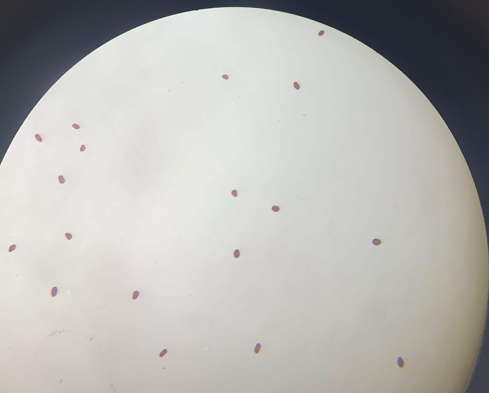
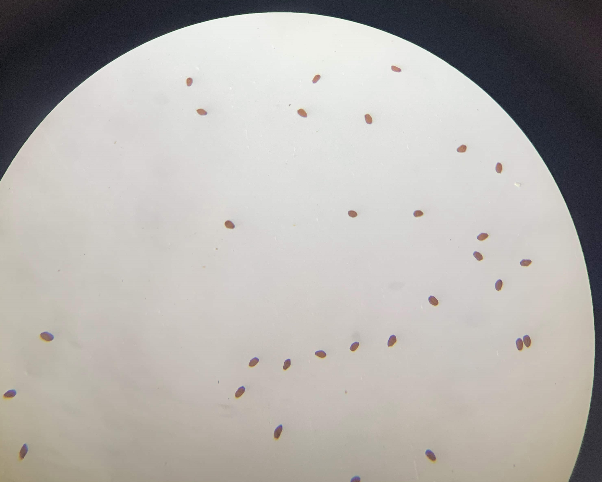
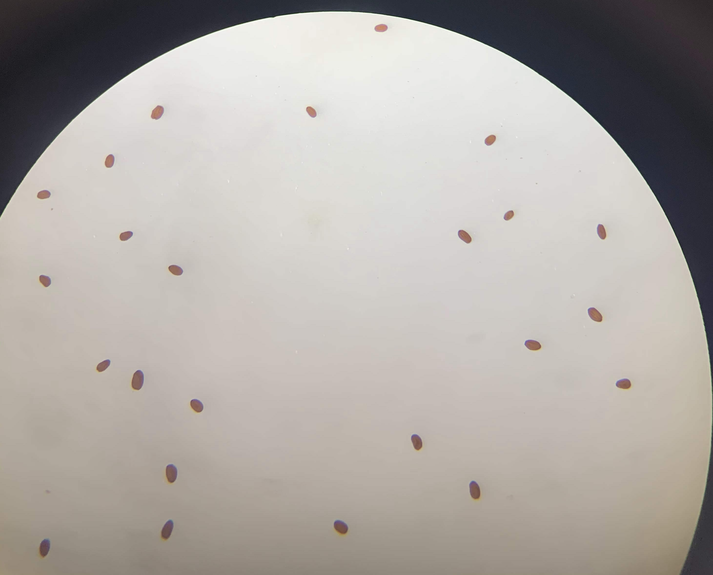
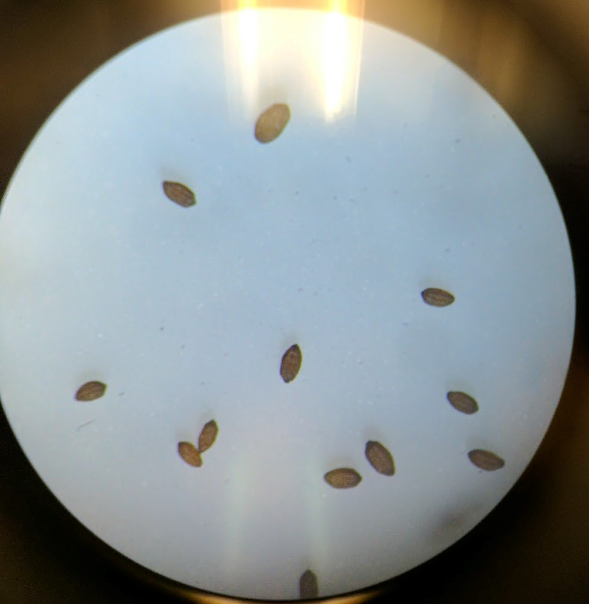
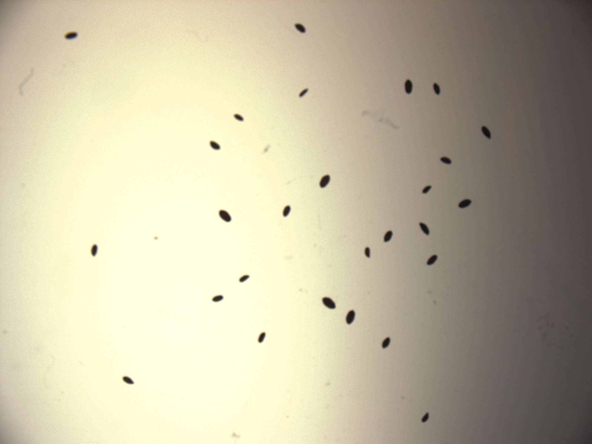
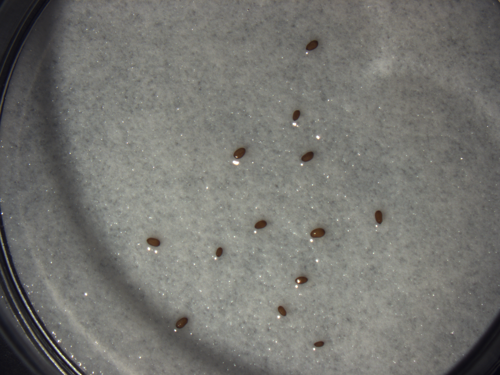
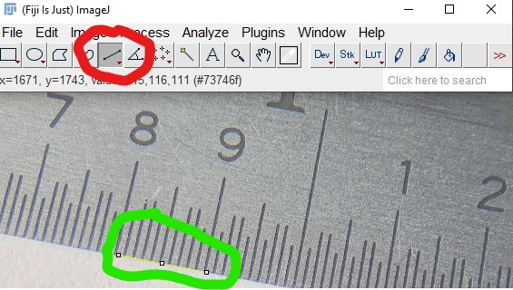
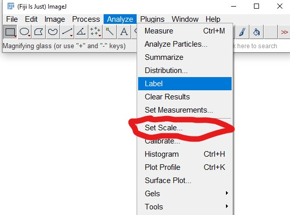
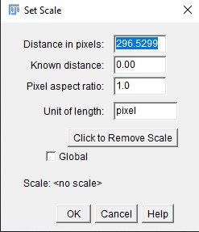
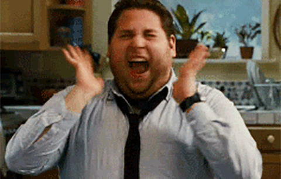

# Measuring seeds using Fiji and other distributions of imageJ
By: Ian C. Anderson <iananderson@berkeley.edu> 

1. [Required Materials](#Required-Materials)
2. [Getting Started](#Getting-Started)
3. [Analysis](#Analysis)
    1. [Scaling Images](#Scaling-Images)
    2. [Threshhold optimization](#Threshhold-optimization)
    3. [Measuring Seeds](#Measuring-Seeds)
## Required Materials

1. A computer with Windows, MacOS, or Linux.
    1. The Python Operating system(Optional, largely unneccesary)  
2. A camera or smartphone with a camera
3. A ruler
4. A stand or other apparatus able to hold camera at consistence distance (very important!)
5. A microscope (optional, but recommended)
6. A copy of ImageJ, Fiji, or any other distribution of ImageJ 2.0 or above.

## Getting Started

1. The most important part of the image measuring process is collecting good, high quality images.
    1. Even lighting, a high contrast background, a clean workspace free of dust and other non-seed related plant parts are all highly recommended.
        1. Most importantly, having these factors consistent across all images is recommended.
        2. While almost any image can be measured, having variable lighting or contrast between different images will make batch processing difficult if not impossible.
2. Here are a few examples of well taken seed images. 

  

Note the even lighting and high contrast. 

3. Here are a few examples of poorly taken seed images.

  

Note the blurry image quality, poor lighting, bad contrast and light bleed from a source light that is too bright

4. It is important while taking images to have a ruler for scale. 
    1. In a perfect world the height between your camera and the subject of your photos will never change. 
    2. We don't live in a perfect world. There will be variablity with how your image is scaled(In one image, a single pixel might be .01mm, while in another it might be .015mm.
    3. Having a ruler in every picture, or taking a picture of a ruler every few pictures is a great way to keep on track.
    4. We have found the sweet spot to be taking a picture of a ruler every 6 images. 
        1. This doubles as a great way to keep track of image IDs.
        2. On most smartphones it is incredibly time consuming to rename or tag images with any useful information. If the order of the seeds is known, it is trivial to rename images based on the order at which the images come in, and taking a picture of a ruler, with a the number in the list the next or last seed image taken was is a great way to help keep yourself on track!
    5. Here is an example of a good image of a ruler.
     
Note how the ruler is straight, the measuring incraments are easy to understand, and the order number is easy to read.    

5. Once you have good images. You are ready to start analyzing!
## Analysis
### Scaling Images
* There are multiple methods to accomplish this, but we will discuss the method using Fiji/ImageJ. Photoshop is useful and fast, but is prohibitively expensive to many users. Gimp is another free alternative.

1. The first step of the process is manaual. You need to measure your rulers.
2. Open the image of your scale in ImageJ
    1. From within ImageJ click the straight line tool(denoted in red) and mark the two pounds between a known point on your ruler. 
        1. Sometimes it is helpful to zoom in to your image to ensure you are hitting the right points. This won't effect the measurement. 
    2.  ImageJ ➡️ Analyze ➡️ Set Scale  
     
    
    3. You will be shown the following screen. Record "Distance in Pixels". The known distance is what ever you chose on your ruler. In our the case of the above example, our known distance would be 1/10th of an inch or 2.54mm. 
    
     
    
    4. Do this for all of your scales.
        1. Ideally, you will see <1% variance between your scales.
        2. This is ideal. In situations like these, we average all of the scales togehter and use this number for final analysis. 
        3. In situations where this is not the case, it is recommended you analyze your seeds in batches where the scale is similar. A worked around is seen in the [advanced ideas section](#advanced-ideas)
### Threshhold optimization  
* Different light sources, and different backdrops are going to produce vastly different levels of contrast between your seeds and what is behind them. For instance, while a standard weigh boat and a piece of printer paper are both white; the weigh boat's slight opacity causes it to appear darker on camera than it does to the eye. This is not a problem, but we must figure out the appropraite threshhold for our images. 

* The threshhold in the included script is set to 168/255. We have found this to be a sweet spot for most images.
1. Open an image you want to analyze.
2. Convert the image to an 8-bit image.
3. Click Run threshhold. 
4. From here, you will be given a slider where you can test different threshholds to find what works best with your seeds. Ultimately 
### Measuring Seeds
* ImageJ is a robust software package. With an endless number of ways to analyze images, a user is able to make subtle changes to customize their workflow. In this guide, I will focus on using ImageJ's GUI to batch process the images. This was the method utalized in `Population responses to a historic drought across the range of the common monkeyflower (Mimulus guttatus)`. More advanced methods utalizing ImageJ's python scripting will can be found in [advanced ideas section](#advanced-ideas)
1. 
### Data Cleanup
### Troubleshooting
### Advanced Ideas
### Acknowledgements
 
